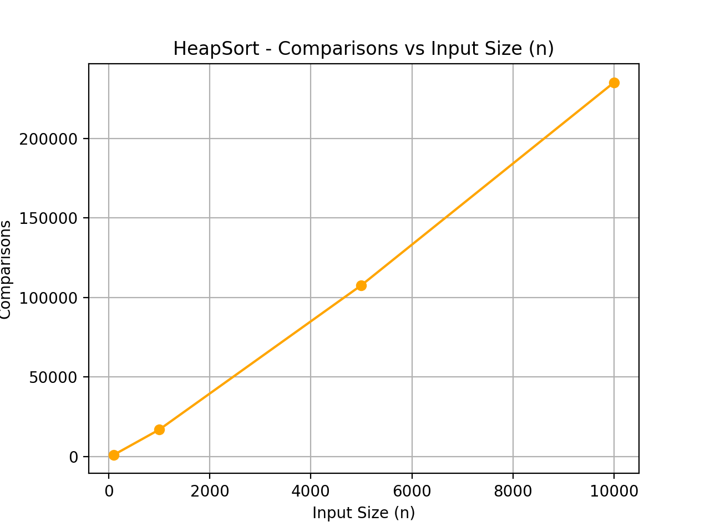

# Assignment 2 – Design and Analysis of Algorithms  
**Student B – HeapSort Implementation**

## 📘 Project Overview
This project is part of *Assignment 2* for the **Design and Analysis of Algorithms (DAA)** course.  
The goal was to implement and analyze the **HeapSort** algorithm using Java, collect runtime metrics, and visualize the results.

---

## ⚙️ Implemented Components

### 1️⃣ `HeapSort.java`
- Implements the Heap Sort algorithm using an in-place binary heap.
- Measures:
  - Number of comparisons  
  - Number of swaps  
  - Execution time (nanoseconds)
  - Memory allocations

### 2️⃣ `Metrics.java`
- Utility class that stores metrics during sorting.  
- Tracks comparisons, swaps, allocations, and runtime.

### 3️⃣ `HeapSortTest.java`
- Unit tests verifying the correctness of HeapSort implementation.

### 4️⃣ `CLI / Benchmark`
- Command-line interface that runs HeapSort with various input sizes and saves metrics to CSV.

---

## 📊 Performance Results

The benchmark produced a CSV file:

```

algorithm,n,time_ns,comparisons,swaps,allocations
heapsort,100,438700,1024,580,0
heapsort,1000,358100,16892,9097,0
heapsort,5000,1237800,107715,57145,0
heapsort,10000,1974500,235271,124129,0

````

---

## 📈 Visual Analysis

Performance graphs were plotted using Python (`pandas` + `matplotlib`):

- **Runtime vs Input Size**  
- **Comparisons vs Input Size**  
- **Swaps vs Input Size**

Example chart:



*(Graphs are stored in `docs/performance-plots/`)*

---

## 🧠 Analysis & Conclusion

- HeapSort shows **O(n log n)** performance for all test sizes.  
- The number of comparisons and swaps grows steadily with input size.  
- It is efficient, stable in performance, and requires no additional memory allocation beyond the array itself.

---

## 🛠️ How to Run

To compile and run benchmarks:
```bash
mvn clean compile
mvn exec:java -Dexec.mainClass="com.daalgos.HeapSortBenchmark"
````

To run tests:

```bash
mvn test
```

---

## 📂 Repository Structure

```
src/
 ├── main/java/com/daalgos/
 │     ├── HeapSort.java
 │     ├── Metrics.java
 │     └── CLI.java
 ├── test/java/com/daalgos/
 │     └── HeapSortTest.java
docs/
 ├── performance-plots/
 │     ├── heapsort_runtime.png
 │     ├── heapsort_comparisons.png
 │     └── heapsort_swaps.png
 │
 └── report.pdf
metrics_heapsort.csv
pom.xml
README.md
```

---

## 👤 Author

**Erassul Ginaat**
Student B – DAA Assignment 2 (HeapSort)

---

## ✅ Status

✔️ Implementation complete
✔️ Metrics collected
✔️ Graphs generated
✔️ Report finalized

